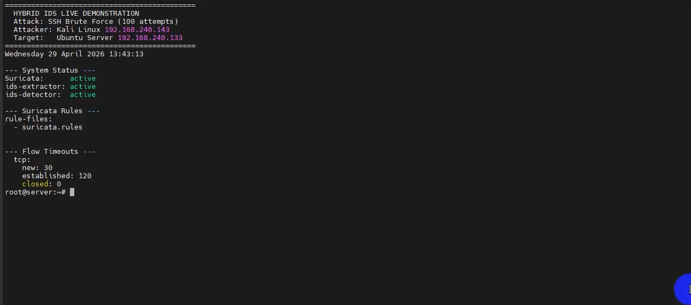
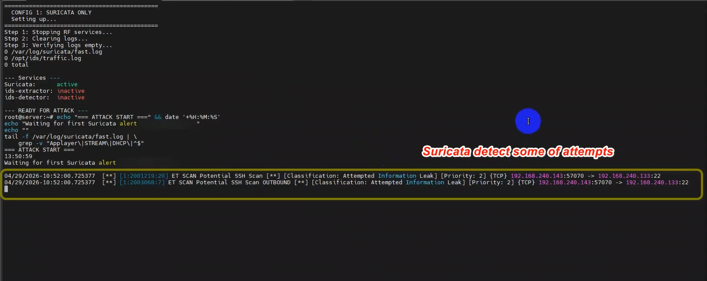
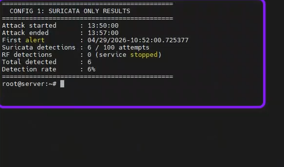
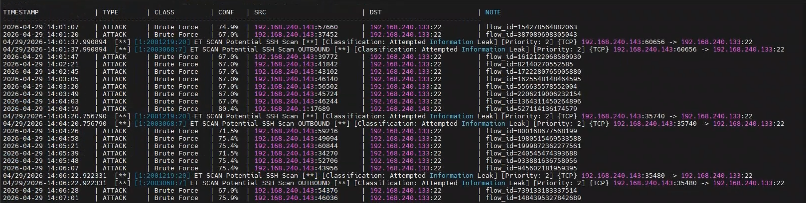
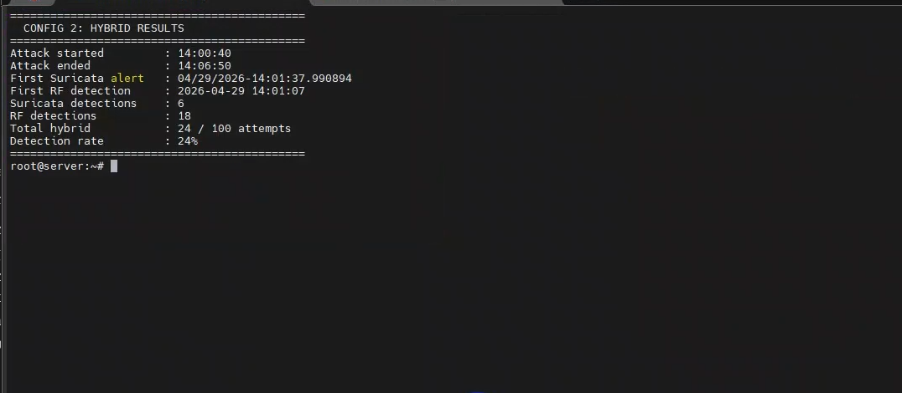

# Machine Learning-Based Intrusion Detection System (IDS)

A hybrid network IDS that combines **Suricata's signature-based detection** with a **Random Forest ML model** trained on the CICIDS2017 dataset. The system detects both known attacks (via Suricata rules) and unknown/novel attacks (via ML classification).

---

## Pipeline Overview

```
Suricata → eve.json → extractor.py → flows.csv → detector.py → traffic.log
                              ↘ alerts_log.csv (known attacks)        ↘ alerts_log.csv (ML-detected attacks)
```

- **extractor.py** — watches Suricata's `eve.json`, extracts 19 flow features, and queues them for the detector
- **detector.py** — reads the feature queue and classifies each flow using the trained Random Forest model

---

## Requirements

- Linux (the scripts use `fcntl` and `syslog` — Linux only)
- Python 3.8+
- Suricata installed and running
- The CICIDS2017 dataset (see step 1 below)

Install Python dependencies:

```bash
pip install numpy pandas scikit-learn matplotlib seaborn joblib
```

---

## Setup & Usage

### Step 1 — Download the CICIDS2017 Dataset

Download the dataset from the [Canadian Institute for Cybersecurity](https://www.unb.ca/cic/datasets/ids-2017.html) and place all CSV files in a folder on your machine.

Then open `data_preprocessing_commented.ipynb` and update this line to point to your folder:

```python
DATASET_PATH = r"/your/path/to/MachineLearningCVE/*.csv"
```

### Step 2 — Run the Preprocessing Notebook

Open and run all cells in `data_preprocessing_commented.ipynb`.

This will generate:
- `X_train.csv`, `X_test.csv`, `y_train.csv`, `y_test.csv`
- `label_encoder.pkl`, `feature_contract.pkl`
- `median_imputation.json`, `feature_extraction_reference.json`

### Step 3 — Train the Model

Open and run all cells in `model_training_commented.ipynb`.

This will generate:
- `random_forest_ids.pkl` — the trained model
- `class_thresholds.json` — per-class confidence thresholds
- `training_results.json` — full evaluation metrics

### Step 4 — Deploy the Model Artifacts

Copy all generated `.pkl` and `.json` files to `/opt/ids/`:

```bash
sudo mkdir -p /opt/ids
sudo cp random_forest_ids.pkl class_thresholds.json median_imputation.json label_encoder.pkl feature_contract.pkl /opt/ids/
```

---

## Running as Linux Services

Both scripts are designed to run as **systemd services** so they start automatically and restart on failure.

### extractor.service

Create the service file:

```bash
sudo nano /etc/systemd/system/extractor.service
```

Paste the following:

```ini
[Unit]
Description=IDS Feature Extractor (Suricata eve.json → flows.csv)
After=network.target suricata.service
Requires=suricata.service

[Service]
ExecStart=/usr/bin/python3 /opt/ids/extractor.py \
    --eve /var/log/suricata/eve.json \
    --queue /opt/ids/flows.csv \
    --alerts /opt/ids/alerts_log.csv
Restart=always
RestartSec=5
User=root

[Install]
WantedBy=multi-user.target
```

### detector.service

Create the service file:

```bash
sudo nano /etc/systemd/system/detector.service
```

Paste the following:

```ini
[Unit]
Description=IDS ML Detector (flows.csv → alerts)
After=extractor.service
Requires=extractor.service

[Service]
ExecStart=/usr/bin/python3 /opt/ids/detector.py \
    --model-dir /opt/ids \
    --queue /opt/ids/flows.csv \
    --alerts /opt/ids/alerts_log.csv \
    --traffic /opt/ids/traffic.log
Restart=always
RestartSec=5
User=root

[Install]
WantedBy=multi-user.target
```

### Enable and Start Both Services

```bash
sudo systemctl daemon-reload
sudo systemctl enable extractor.service detector.service
sudo systemctl start extractor.service detector.service
```

### Check Service Status

```bash
sudo systemctl status extractor.service
sudo systemctl status detector.service
```

### View Logs

```bash
# Service logs
sudo journalctl -u extractor.service -f
sudo journalctl -u detector.service -f

# IDS output logs
tail -f /opt/ids/traffic.log
tail -f /opt/ids/alerts_log.csv
```

---

## Output Files

| File | Description |
|------|-------------|
| `/opt/ids/flows.csv` | Feature queue between extractor and detector |
| `/opt/ids/alerts_log.csv` | All detected attacks (Suricata + ML) |
| `/opt/ids/traffic.log` | All classified flows in human-readable format |

---

## Detected Attack Classes

The model classifies network flows into 6 classes:

- BENIGN
- DoS / DDoS
- PortScan
- Brute Force
- Bot
- Web Attack

---

## Live Demonstration

The following screenshots show a real test: **100 SSH Brute Force attempts** launched from Kali Linux (`192.168.240.143`) against an Ubuntu Server (`192.168.240.133`).

### System Status — All Services Active


### Config 1: Suricata Only — Attack Detected
Suricata detects only **2 flows** out of the 100 attempts (scanning signatures only).



**Result: 6 detections / 100 attempts — 6% detection rate**



---

### Config 2: Hybrid (Suricata + RF Model) — Attack Detected
The ML detector picks up the flows Suricata missed, classifying them as Brute Force with confidence scores.



**Result: 24 detections / 100 attempts — 24% detection rate (6 Suricata + 18 RF)**



> The hybrid system detected **4× more attacks** than Suricata alone in this test.

---

## Notes

- The scripts default to `/opt/ids/` for all files and `/var/log/suricata/eve.json` for Suricata's log. These can be changed via command-line arguments or by editing the `DEFAULT_*` constants at the top of each script.
- Training was done on 19 Suricata-aligned features. The feature list is saved in `feature_contract.pkl` and must not be changed after training.
